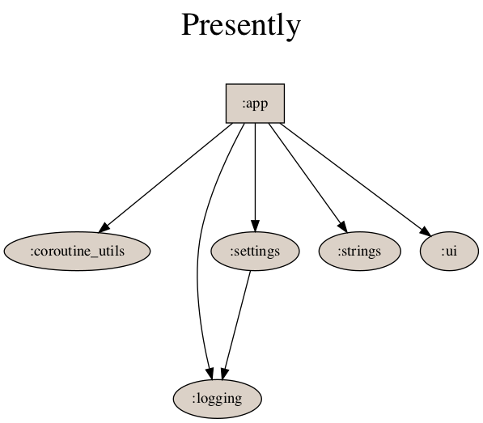

# Presently: A Gratitude Journal

A journal to write what you're thankful for. Contributions welcome!

[Google Play Posting](https://play.google.com/store/apps/details?id=journal.gratitude.com.gratitudejournal&hl=en)

### Philosophy 
Presently is built on the idea that gratitude journaling should be free, private, and available to all. It will never have ads, never have a premium version, and will always be open source. Entries are kept on device and can be exported to CSV.

Presently is also built with the best Android practices in mind. It follows MVVM to separate concerns and ensure we write testable code. We require 80%+ code coverage and rely on both unit tests and instrumented tests (with a heavier weight towards unit tests). Instrumented tests are run on Firebase Test Lab, crashes are reported through Crashlytics, and analytics are reported with Firebase Analytics.

We support several languages currently and are always looking for translators to help us! We support French, Spanish, Italian, German, Finnish, Arabic, Dutch, Polish, Portuguese, Slovakian, Croatian, Romanian, Turkish, Russian, Afrikaans.

### Tech Stack [So far...]
- MVVM with architecture components
   - ViewModel
   - Room (with FTS and Paging v3)
- Mavericks
- CircleCI
- Jacoco coverage reports (integrated with CI)
- Firebase Crashlytics Crash Reporting
- Dagger + Hilt
- Espresso
- Firebase Test Lab
- WorkManager
- Dropbox Java SDK

## Design
   

The app currently has over 40 themes to choose from! Here's a few:

           

### Contributions
Contributions are welcome! Please fork the repo and make a PR. Forked PRs will build the app and run unit tests but will not run instrumented tests. A repo owner will run those tests as they require secret keys. To make the app build locally you'll need to add a Dropbox Key (or any string if you don't want to test Dropbox backup features) to the `local.properties` file. Like so: `DROPBOX_KEY=myDropboxKey`.

### Dependency Graph
Presently is a small and simple app, did it need modularizing? Probably not. But Presently also servees as a playground for me for trying out new technologies and keeping up with best practices. Here's how we've broken down the app so far.

